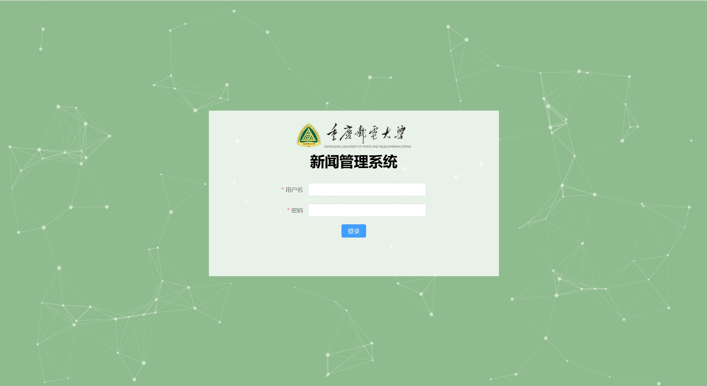
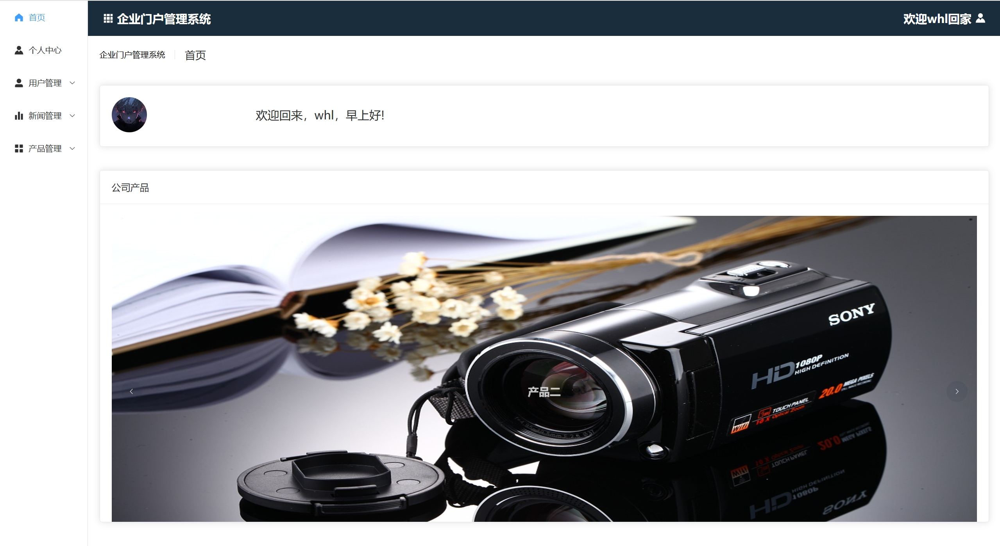
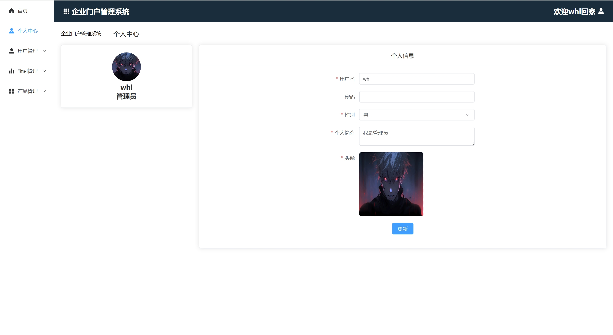
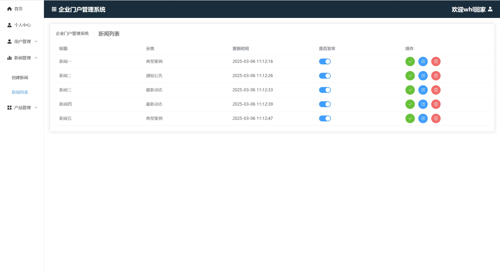
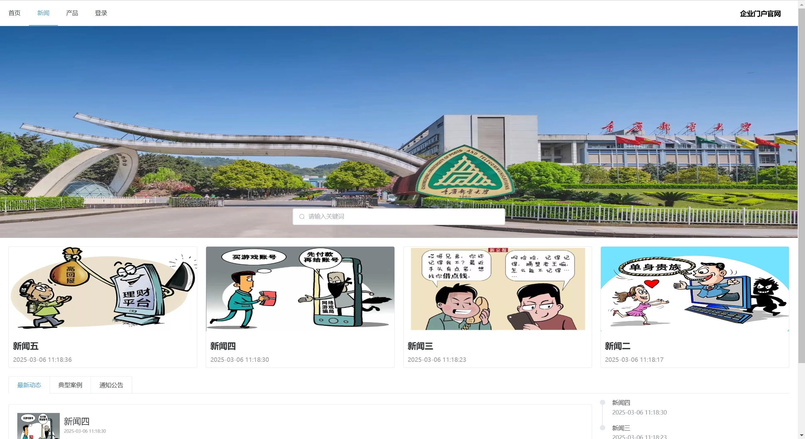

# 重邮新闻信息管理系统


> 基于Vue3+ElementPlus+Express的全栈新闻信息管理系统，包含管理后台和新闻门户双端

## 🚀 技术栈
Vue3 + Vue-Router + Vuex +Vite + Axios + Element-Plus + Sass + Express + MongoDB

### 前端技术
| 模块          | 技术方案                         | 版本     |
|---------------|--------------------------------|----------|
| 核心框架       | Vue3 + Composition API        | 3.2.13   |
| 状态管理       | Vuex + vuex-persistedstate     | 4.x      |
| UI框架        | Element Plus                  | 2.9.1    |
| 可视化        | tsparticles + particles.vue3  | 2.12.0   |
| 富文本编辑器   | @wangeditor                   | 5.x      |

### 后端技术
| 模块          | 技术方案                | 版本     |
|---------------|-----------------------|----------|
| 运行时        | Node.js               | 18.x     |
| Web框架       | Express               | 4.21.2   |
| 数据库        | MongoDB + Mongoose    | 8.0.0    |
| 安全认证      | JWT                   | 9.x      |

## ✨ 功能特性

### 管理后台（admin）
- 📝 富文本新闻编辑器（支持图文混排）
- 👥 RBAC权限管理系统（管理员/编辑角色）
- 📁 可视化数据管理（新闻/产品/用户）
- 🖼️ 图片上传组件（自动地址转换）
- ✨ 粒子动画登录页

### 新闻门户（web）
- 📰 新闻分类展示（动态/案例/公告）
- 🔍 全文检索功能
- 📱 响应式布局
- ⏳ 时间格式化处理
- 🔄 API数据缓存

## 🛠️ 安装与运行

### 环境要求
- Node.js 18.x
- MongoDB 6.x

### 快速启动
```bash
# 克隆项目
git clone https://github.com/your-repo/cqupt-news.git

# 安装依赖
cd admin && npm install
cd web && npm install
cd server && npm install

# 启动服务
npm run dev # 客户端和管理端
npm run start # 服务端

# 生产构建
npm run build
```
## 📸 项目部分截图

### 管理后台界面

| 模块 | 预览 |
|------|------|
| **登录页** |  |
| **首页** |  |
| **个人中心** |  |
| **创建新闻** |  |
| **新闻管理** |  |


### 新闻门户界面
| 模块 | 预览 |
|------|------|
| **首页** |  |
| **新闻页** |  |
